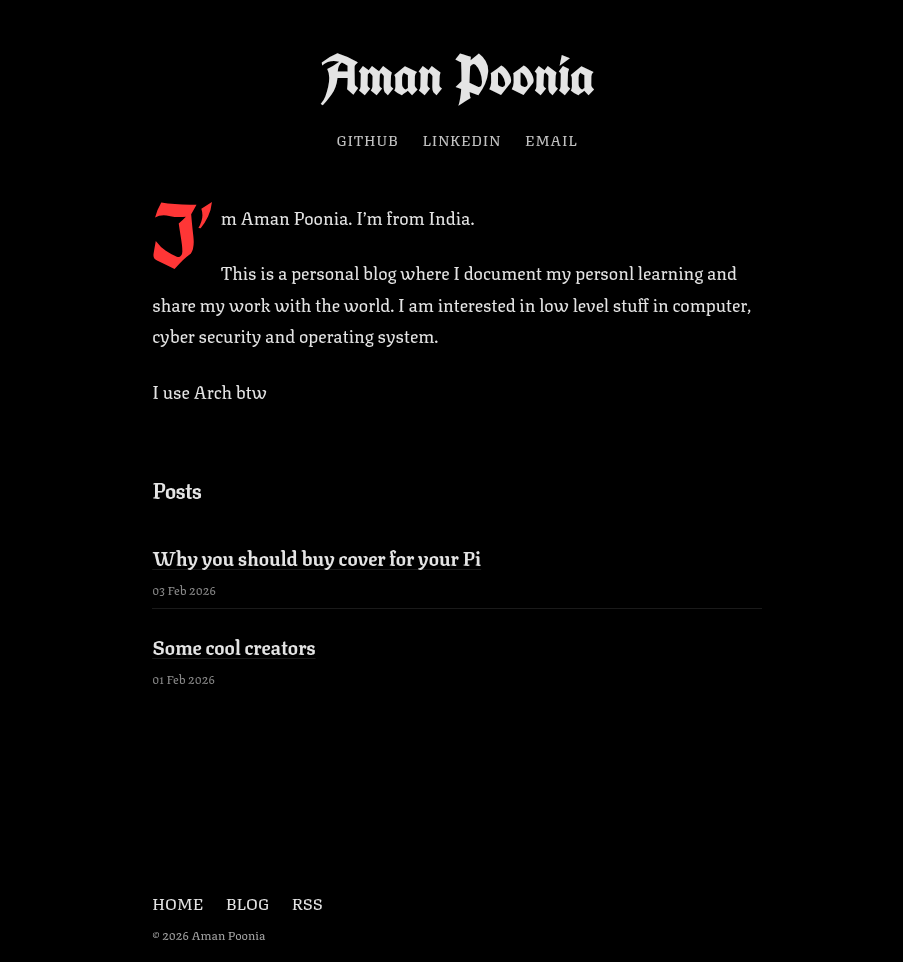

# Dark Forest

A minimal black, white, and red Hugo theme with serif body text and blackletter headings.



## Features

- **Black/red design** — pure black background, off-white text, red accent
- **Serif + blackletter type** — Texturina body, UnifrakturCook display headings
- **Code friendly** — JetBrains Mono with Chroma syntax highlighting
- **Bottom navigation** — menu lives in the footer
- **RSS feed** — home, section, and per-post feeds
- **SEO meta** — description plus Open Graph tags on every page
- **Lazy images** — Markdown images load lazily via a render hook
- **Custom 404 page** — text-based, message set from site config

## Installation

### Method 1: Git Submodule (Recommended)

```bash
cd your-hugo-site
git init  # if not already a git repo
git submodule add https://github.com/xeniumcode/dark-forest.git themes/dark-forest
```

### Method 2: Manual Download

Download the theme and extract it to `themes/dark-forest`.

## Configuration

Copy the `example.toml` from the theme directory to your site's root as `hugo.toml`:

```bash
cp themes/dark-forest/example.toml hugo.toml
```

Then customize it. Available params:

```toml
[params]
  author = 'Your Name'
  description = 'Description of your site'
  favicon = '/favicon.png'
  notFoundMessage = 'Text shown on the 404 page'
  showRecentPosts = true
  recentPostsCount = 3

[[params.social]]
  name = 'GitHub'
  url = 'https://github.com/yourusername'
  target = '_blank'
  rel = 'noopener noreferrer'
```

## Creating Content

### Homepage

Create `content/_index.md`:

```markdown
+++
title = 'Home'
draft = false
+++

Hey, I am [Your Name]. Welcome to my blog!

I write about technology, programming, and other interesting things.
```

### Posts

Create a new post:

```bash
hugo new content posts/my-first-post.md
```

## Customization

### Favicon

Set a custom favicon in your Hugo config:

```toml
[params]
favicon = "/images/my-favicon.png"
```

If you don't specify one, the theme uses its default SVG favicon at `/favicon.svg`.

### Colors

Edit `themes/dark-forest/assets/css/main.css` to customize colors:

```css
:root,
[data-theme="dark"] {
  --bg-color: #000000;
  --text-color: #e5e5e5;
  --accent-color: #ff3333;
  --muted-color: #a3a3a3;
  --border-color: rgba(255, 255, 255, 0.1);
}
```

## License

MIT License
